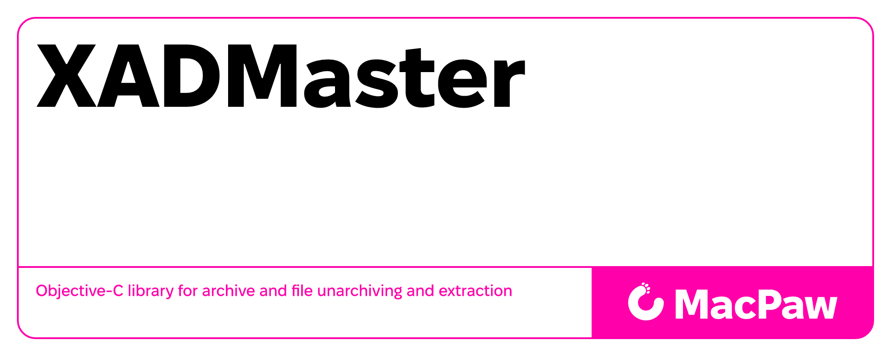

# Objective-C library for archive and file unarchiving and extraction



[](https://travis-ci.org/MacPaw/XADMaster)
* Supports multiple archive formats such as Zip, Tar, Gzip, Bzip2, 7-Zip, Rar, LhA, StuffIt, several old Amiga file and disk archives, CAB, LZX. Read [the wiki page](http://code.google.com/p/theunarchiver/wiki/SupportedFormats) for a more thorough listing of formats.
* Supports split archives for certain formats, like RAR.
* Uses [libxad](http://sourceforge.net/projects/libxad/) for older and more obscure formats. This is an old Amiga library for handling unpacking of archives.
* Depends on [UniversalDetector Library](https://github.com/MacPaw/universal-detector). Uses character set autodetection code from Mozilla to auto-detect the encoding of the filenames in the archives. 
* The unarchiving engine itself is multi-platform, and command-line tools exist for Linux, Windows and other OSes.
* Originally developed by [Dag Ågren](https://github.com/DagAgren)


# Building

XADMaster relies on its directory structure. To start development you'll need to clone the main project with the Universal Detector library:
```
git clone https://github.com/MacPaw/XADMaster.git
git clone https://github.com/MacPaw/universal-detector.git UniversalDetector
```
The resulting directory structure should look like:

```
<development-directory>
  /XADMaster
  /UniversalDetector
```

## macOS command-line tools

The `unar` and `lsar` Xcode targets include the complete set of formats supported by this XADMaster checkout, including the vendored libxad and WavPack implementations. They require Xcode and [just](https://github.com/casey/just), as well as the sibling `UniversalDetector` checkout shown above.

Build both tools for the host architecture:

```sh
just cli
```

Build universal binaries for Apple Silicon and Intel Macs:

```sh
just cli-universal
```

The native binaries are written to `build/macos-native/Build/Products/Release/`; universal binaries are written to `build/macos-universal/Build/Products/Release/`. The build configuration and deployment target can be overridden when invoking `just`, for example:

```sh
just configuration=Debug deployment_target=13.0 cli
```

# Usages

- [The Unarchiver](https://theunarchiver.com/) application.


# License

This software is distributed under the [LGPL 2.1](https://www.gnu.org/licenses/lgpl-2.1.html) license. Please read LICENSE for information on the software availability and distribution.
